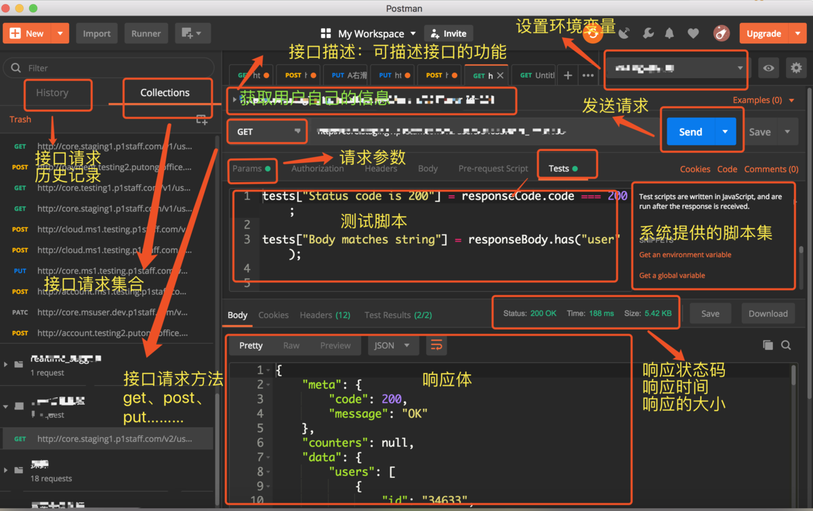

# 十一.Mock 数据

::: tip 前言
前后端同时开发的时候，后端接口数据没有出来，前端可以 mock 假数据，模拟开发，无需等待后的开发完成
:::

- 接口规范（成功，失败，状态码，安全） 和后端约定
- Postman 一款非常流行的 API 调试工具，通过工具可以更好地测试接口。安装后相关功能展示如下

  

## 1. 本地请求

**1.mock 数据**

- 在 public 下建立文件，/mock/user/login.json

  ```json
  {
    "status": 0,
    "data": {
      "xxx": 123
    },
    "msg": "success"
  }
  ```

**2.mock 请求**

- 这种方式简单方便，但是缺点很明显，mock 数据写死了，每次请求都是相同的内容，无法应对复杂的场景

  ```js
  //本地加载请求静态json文件的形式
  this.$axios.get("/mock/user/login.json").then((res) => {
    this.res = res
  })
  ```

## 2. 第三方平台

**1.mock 数据**

在第三方平台上写好相关接口和数据

**2.mock 请求**

```js
//使用mock 网站做模拟接口，注意解决跨域问题（可以降级浏览器解决）
this.$axios.get("/user/login").then((res) => {
  this.res = res
})
```

main.js:

```js
axios.defaults.baseURL = 'mock 网站生成项目 mock 数据地址' //用未来实际地址替换
...
axios.get('/user/login').then( res => {})
```

## 3. webpack 方式

**1.mock 数据**

- 在 public 下建立文件，/mock/user/login.json

```json
{
  "status": 0,
  "data": {
    "xxx": 123
  },
  "msg": "success"
}
```

- /mock/http.js

```js
module.export = function http(app) {
  app.get("/mock/user/login.json", (req, res) => {
    if(xxx){
      ....
      res.json({ data: "" })
    }
  })
}
```

vue.config.js

```js
const httpRequest = require('./mock/http')
...
devServer:{
  before(app) {
    httpRequest(app) // 调用 mock 函数，由于webpack可以读写文件，可以对/mock/user/login.json进行读写操作，用户提交的post请求，可以保存数据
  }
}
...
```

**2.mock 请求**

App.vue：

```js
//本地加载请求静态json文件的形式
this.$axios.get("/mock/user/login.json").then((res) => {
  this.res = res
})
```

## 4.第三方接口

### 4.1 聚合数据

> 聚合数据（[https://www.juhe.cn/docs](https://www.juhe.cn/docs)）是国内领先的基础数据服务商， 以自有数据为基础，各种便捷服务整合以及第三方数据接入，为互联网开发全行业提供标准化 API 技术支撑服务的 DaaS 平台。

- **案例（历史上的今天）**

::: demo

```vue
<template>
  <div>
    <p>今天日期: {{ value }}</p>
    <el-button @click="getHistoryData">点击查看</el-button>
    <ul class="content">
      <li v-for="(item, index) in list" :key="index" :list="list">
        <p style="color:#409eff;">{{ item.title }}</p>
      </li>
    </ul>
  </div>
</template>
<script>
export default {
  data() {
    return {
      value: new Date().toLocaleString(),
      list: [
        {
          day: "1\/1",
          date: "-45年1月1日",
          title: "罗马共和国开始使用儒略历",
          e_id: "1",
        },
        {
          day: "1\/1",
          date: "404年1月1日",
          title: "东晋将领桓玄正式称帝，国号楚",
          e_id: "2",
        },
        {
          day: "1\/1",
          date: "860年1月1日",
          title: "西法兰克国王厄德一世诞生",
          e_id: "3",
        },
      ],
    }
  },
  methods: {
    // 注意：接口存在跨域，需要后端先拿到数据然后传给前端
    getHistoryData() {
      let date = this.value.toLocaleString().split(" ")[0].split("/"),
        key = "cd32de53098100d56ae1b7a25306ddd3"
      console.log(date)
      this.list = []
      fetch(
        `https://v.juhe.cn/todayOnhistory/queryEvent.php?key=${key}&date=${date[1]}/${date[2]}`,
        {
          method: "GET",
        }
      ).then(
        (response) => {
          if (!response.error_code) {
            response.result.map((e) => {
              this.list.push({
                title: e.title,
                desc: e.des,
                src: e.pic,
              })
            })
          }
        },
        (error) => {
          //处理错误
        }
      )
    },
  },
}
</script>
```

:::

- **案例（ip 地址查询）**

::: demo

```vue
<template>
  <div>
    ip:<el-input v-model="value" />
    <el-button @click="getIpData">点击查看</el-button>
    <p>
      地址：{{ res.Country }}-{{ res.Province }}-{{ res.City }}-{{
        res.District
      }}
      类型：{{ res.Isp }}
    </p>
  </div>
</template>
<script>
export default {
  data() {
    return {
      value: "120.235.95.64",
      res: {
        Country: "中国",
        Province: "广东",
        City: "佛山",
        District: "三水区",
        Isp: "移动",
      },
    }
  },
  methods: {
    // 注意：接口存在跨域，需要后端先拿到数据然后传给前端
    getIpData() {
      let key = "d0ad7563a875b7459410d4da2c5b678f"
      this.list = []
      fetch(`https://apis.juhe.cn/ip/ipNewV3?key=${key}&ip=${this.value}`, {
        method: "GET",
      }).then(
        (response) => {
          if (!response.error_code) {
            this.res = response.result
          }
        },
        (error) => {
          //处理错误
        }
      )
    },
  },
}
</script>
<style>
.content {
  max-height: 100px;
  overflow-y: auto;
}
</style>
```

:::

- **案例（今日国内油价查询）**

::: demo

```vue
<template>
  <div>
    <el-button @click="getIpData">点击查看</el-button>
    <ul class="content">
      <li v-for="(item, index) in list" :key="index" :list="list">
        <p style="color:#409eff;">{{ item.city }}：{{ item.b0 }}元</p>
      </li>
    </ul>
  </div>
</template>
<script>
export default {
  data() {
    return {
      list: [
        {
          city: "河北",
          b90: "-",
          b93: "",
          b97: "",
          b0: "8.15",
          "92h": "8.46",
          "95h": "8.94",
          "98h": "9.76",
          "0h": "8.15",
        },
        {
          city: "天津",
          b90: "-",
          b93: "",
          b97: "",
          b0: "8.15",
          "92h": "8.46",
          "95h": "8.94",
          "98h": "0.00",
          "0h": "8.15",
        },
        {
          city: "山西",
          b90: "-",
          b93: "",
          b97: "",
          b0: "8.22",
          "92h": "8.40",
          "95h": "9.07",
          "98h": "9.77",
          "0h": "8.22",
        },
      ],
    }
  },
  methods: {
    // 注意：接口存在跨域，需要后端先拿到数据然后传给前端
    getIpData() {
      let key = "22044931eb3973d36300331491b0546f"
      this.list = []
      fetch(`https://apis.juhe.cn/cnoil/oil_city?key=${key}`, {
        method: "GET",
      }).then(
        (response) => {
          if (!response.error_code) {
            response.result.map((e) => {
              this.list.push({
                title: e.title,
                desc: e.des,
                src: e.pic,
              })
            })
          }
        },
        (error) => {
          //处理错误
        }
      )
    },
  },
}
</script>
```

:::

### 4.2 其他第三方接口

除了整合型的第三方接口聚合数据外，其他比较实用的第三方接口还有：

- [高德地图](https://lbs.amap.com/)：访问高德地图的 Web API
- [GitHub](https://developer.github.com/v3/)：世界上领先的软件开发平台
- [百度翻译](https://api.fanyi.baidu.com/api/trans/product/index)：支持多种语言之间的相互翻译
- [和风天气](https://www.heweather.com/documents/)：中国天气信息
- [阿凡达数据](https://www.avatardata.cn/Docs) ：提供中国可用的 API

::: tip 总结
通过对 mock 数据的了解，可以在以后项目开发中与后端并行开发项目，实现快速迭代需求的目的
:::
