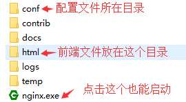

# 十三.构建部署

::: tip 前言
前端开发也需要懂一些基本部署知识，确认已发布，测试是否成功发布本次项目代码
:::

## 1.git 常用功能

在 vscode 中安装代码提交工具`GitLens`插件


**`dev`开发分支，`master`主分支，现在`dev`开发完成，需要合并到`master`**

### 1.1 代码提交

为防止有冲突产生，可以先将本地代码暂存；然后拉取代码，然后将暂存的代码合并，有冲突解决冲突后再提交

### 1.2 创建分支

### 1.3 切换分支

```sh
git checkout dev
```

### 1.4 分支合并

- **1.将 master 代码更新**

  ```sh
  git pull origin master
  ```

- **2.将 master 合并到 dev**

  ```sh
  git checkout dev
  git merge master
  ```

- **3.将 dev 合并到 master**

  ```sh
  git commit -m '代码提交' # （有冲突解决冲突）
  git push -u dev
  git checkout master
  git merge dev
  ```

### 1.5 临时存储

有些功能代码暂时不确定是否要合并到代码中、自己的一些测试代码、写了一半功能的代码、此版本不需要提交的代码

### 1.6 代码比较

### 1.7 代码回退

- 反向提交

  - 1.当代码已经 commit 但没有 push 时，可使用如下命令操作：

  ```sh
  git revert HEAD //撤销倒数第一次提交
  git revert HEAD^ //撤销倒数第二次提交
  git-revert HEAD~2 //撤销倒数第三次提交
  git revert commit //（比如：fa042ce57ebbe5bb9c8db709f719cec2c58ee7ff）撤销指定的版本，撤销也会作为一次提交进
  ```

  - 2.当代码已经 commit 并 push 时，可使用如下命令：

  ```sh
  git revert HEAD~1 //代码回退到前一个版本
  ```

- 删除提交
  - 1.如果我们的有两次 commit 但是没有 push 代码
  ```sh
  git reset HEAD~1      //撤销前一次 commit，所有代码回到 Working Copy
  ```
  - 2.假如我们有几次代码修改，并且都已经 push 到了版本库中。
  ```sh
  git reset --hard HEAD~2   //本地的Wroking Copy回退到2个版本之前。
  ```

[参考教程](https://www.jianshu.com/p/95a1a06ac0fb)

## 2.部署验证

::: warning 注意
有时候部署比较敏感，如紧急上 uat 环境，为了防止出意外导致投诉（如测试）或者确定前端代码部署质量排查部署产生的问题，可以先在本地安装 nginx 模拟线上环境，校验前端打包后的代码是否是正常的，自己确定修改无误后再部署
:::

- 1.本地配置 nginx

  - windows 环境中 [下载 nginx](https://nginx.org/en/download.html)，然后在安装目录下解压

    

  - 在 Nginx 的目录下使用 cmd 命令行，启动之后，打开 http://localhost:80 就能看的效果
    ```sh
    start nginx           # 启动
    ```
  - 常见命令
    ```sh
    start nginx           # 启动
    nginx -s stop         # 快速停止（不保存相关信息）
    nginx -s quit         # 有序停止（保存相关信息）
    nginx -s reload       # 重启（修改配置文件后用这个）
    ```

* 2.打包项目代码，配置 nginx 指向打包目录

  ```sh
  npm run build
  ```

  ```sh
  # nginx/conf/nginx.conf
  ...
  location /[项目二级目录] {
    root D:/project/[项目名称]
    try_fiels $uri $uri/ /[打包目录]/index.html
    index index.html index.htm
  }
  ...
  ```

- 3.本地重启 nginx，验证打包代码（在安装根目录下启用 cmd）

  ```sh
  nginx -s reload       # 重启
  ```

## 3.部署项目

- **方式一**：直接上传本地打包后的代码到服务器

  ```sh
  npm run build:sit
  ```

  通过 ftp 等工具将 dist 目录下的打包文件传输到服务器指定目录（服务器上需先启动 nginx）

- **方式二**：通过相关工具部署流水线（gitlab）

## 4.部署完成

::: warning 注意
有时候部署后需要查看代码是否更新，作出相关动作（刷新页面）
:::

- 在 public 下建立文件，/version.json（打包时 webpack 向此文件写入打包信息）

  ```json
  {
    "projectName": "xxx",
    "version": "xxx1.13",
    "date": "2021/12/19",
    "time": "123"
  }
  ```

* 刷新页面
  ```js
  // main.js
  setTimeout(() => {
    axios.get("/version.json").then((res) => {
      if (res.data.time !== localStorage.time) {
        localStorage.time = res.data.time;
        message("项目有更新,10s后自动刷新页面");
      }
    });
  }, 10000);
  ```

::: warning 可能遇到的问题
linux 下有权限问题，如配置完成后访问出现 403,可以配置 SELINUX=disabled 解决
:::

::: tip 总结
通过对 vue 项目构建部署的了解，可以看到前端也需要学习一些构建部署知识，能在日常开发中轻松处理相关问题
:::
