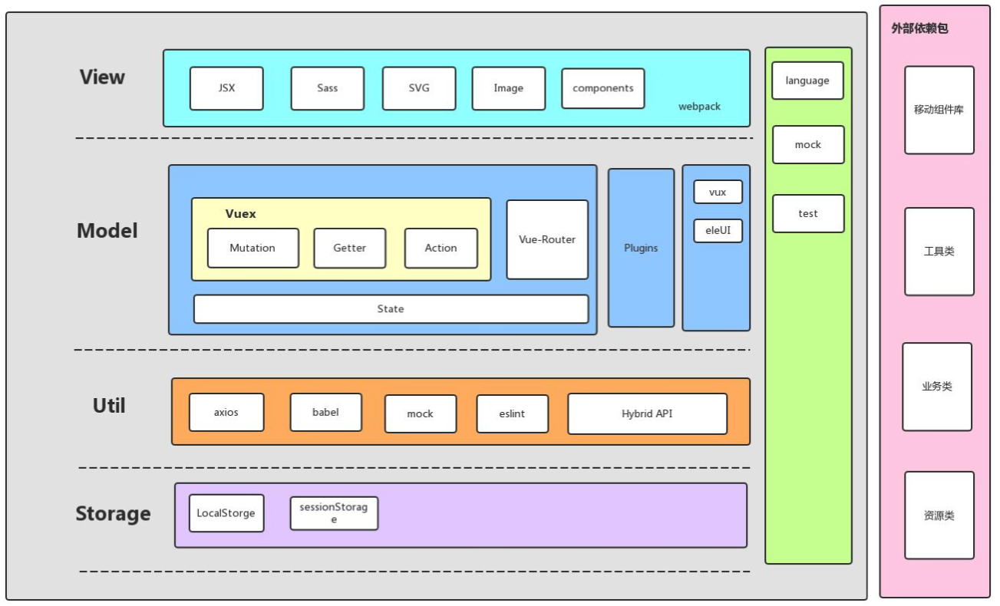

# 二.创建项目

::: tip 前言
了解 vue 项目创建过程以及其目录结构，在开发中需要注意的地方，能够更好地规范前端开发
:::

## 1.vue-cli 2.x 中

- 安装`vue-cli`

```bash
npm install -g vue-cli
```

- 项目创建

```bash
vue init <template-name> <project-name>
npm i
npm run dev
# 使用旧版（2.X）创建
npm install -g @vue/cli-init
# 'vue init'的运行效果与‘vue-cli@2.x’相同
vue init webpack projectname
```

## 2.vue-cli 3.x 中

### 2.1 安装 `@vue/cli`

```bash
node -v             # Vue-cli3.0 需要在 Node.js 8.9 或更高版本
npm -v              # 在安装 node 的时候，npm 包管理器会自动安装，通过查看 npm 版本来判断是否安装成功
npm i -g @vue/cli   # 或者使用yarn安装 yarn install -g @vue/cli  全局安装 Vue-cli 3.0
```

### 2.2 通过 `@vue/cli` 创建项目

```bash
vue create vue3-demo
```

### 2.3 打开项目

- 代码展示
  

- 项目目录结构

  ```bash
  ├── node_modules     # 项目依赖包目录，存放下载依赖的文件夹
  ├── public           # 存放不会变动静态的文件，它与src/assets的区别在于，public目录中的文件不被webpack打包处理，会原样拷贝到dist目录下
  │   ├── favicon.ico  # 在浏览器上显示的图标
  │   └── index.html   # 主页面文件
  ├── src              # 源码文件夹
  │   ├── assets       # 存放组件中的静态资源
  │   ├── components   # 存放一些公共组件
  │   ├── views        # 存放所有的路由组件
  │   ├── App.vue      # 应用根主组件
  │   ├── main.js      # 应用入口 js
  │   ├── router       # 路由配置文件
  │   └── store        # vuex状态管理文件
  ├── .eslintrc.js     # eslint相关配置
  ├── .gitignore       # git 版本管制忽略的配置
  ├── .postcssrc.js    # postcss一种对css编译的工具，类似babel对js的处理
  ├── babel.config.js  # babel 的配置,即ES6语法编译配置
  ├── package.json     # 项目基本信息,包依赖配置信息等
  └── yarn.lock        # 用于记录当前状态下实际安装的各个包的具体来源和版本号等, 保证其他人在 npm install 项目时大家的依赖能保证一致.
  ```

### 2.4 运行项目

- 查看 vue 版本

  ```sh
  vue --version # 查询版本是否为3.x
  ```

- 启动项目

  ```bash
  yarn serve # 或者 npm run serve
  ```

- 最终展示
  

## 3.前端结构



::: tip 总结
了解 vue 项目创建过程以及其目录结构，在开发中需要注意的地方，能够更好地规范前端开发
:::
