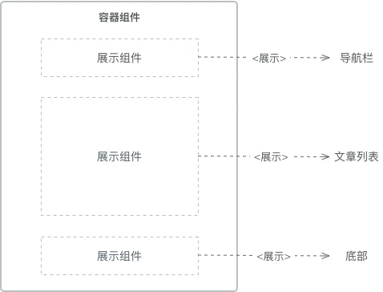

# 六.页面布局

::: tip 前言
页面布局决定了一个页面的整体结构，一个好的布局能使整个页面一眼看上去结构清晰，层次分明,可以简单地将组件分为：容器组件与展示组件
:::



## 1.职能划分

Vue 组件按照职能划分，我们可以将其分为两种类型：容器组件和展示组件

- 容器组件：它是一个容器性质的组件，我们可以把它理解为最外层的父组件，也就是最顶层的组件，一般我们把它放置在 `views` 文件夹下，其功能主要用于做数据提取与实现公共逻辑，然后渲染对应的子组件。

- 展示组件：主要用于做展示的组件，其主要功能是负责接收从容器组件传输过来的数据并在页面上渲染，实现其内部独有的功能逻辑。

容器组件就是整个首页最外层的父组件，而展示组件就包含了导航栏、文章列表、底部等子组件，代码层面如下：

```vue
<template>
  <div>
    <navigation @count="countFn"></navigation>
    <article :list="articleList"></article>
    <foot></foot>
  </div>
</template>
<script>
import { mapActions, mapGetters } from 'vuex';
export default {
    mounted() {
        this.SET_BLOG_DATA(); // 调用接口获取数据
    },
    computed: {
        ...mapGetters(['articleList']), // 监听 state
    }
    methods: {
        ...mapActions(['SET_BLOG_DATA', 'SET_NAV_COUNT']),
        countFn(item) {
            this.SET_NAV_COUNT({ type: item.type });
            this.$router.push({name: item.route});
        }
    }
}
</script>
```

以上是首页容器组件中的主要代码，其主要做了两件事情：数据的传递和回调的处理，当然还可以包括处理一些该页面中不属于任何一个展示组件的方法，比如校验登录状态。在一个容器组件中可以包含多个展示组件，下面我们来看一下展示组件 `Navigation` 中的代码：

::: demo

```vue
<template>
  <ul>
    <li
      v-for="(item, index) in nav"
      :key="index"
      @click="goNav(item)"
      v-text="item.name"
    ></li>
  </ul>
</template>
<script>
export default {
  data() {
    return {
      nav: [
        {
          name: "首页",
          route: "index",
          type: "index",
        },
        {
          name: "文章",
          route: "article",
          type: "article",
        },
        {
          name: "关于",
          route: "about",
          type: "about",
        },
      ],
    }
  },
  methods: {
    goNav(item) {
      this.$emit("count", item) // 触发回调
    },
  },
}
</script>
```

:::

`Navigation` 导航组件只负责自己内部的数据渲染和回调逻辑，对于存储每个导航的点击量及跳转逻辑来说，作为展示组件这并不是其所关心的，所以我们需要通过触发容器组件回调的方式来实现。再来看一下展示组件 `Article` 的代码：

```vue
<template>
  <ul>
    <li
      v-for="(item, index) in list"
      :key="index"
      @click="goPage(item.id)"
      v-text="item.title"
    ></li>
  </ul>
</template>

<script>
export default {
  props: {
    // 接收容器组件数据
    list: {
      default: [],
      type: Array,
    },
  },
}
</script>
```

展示组件 Article 中动态的数据通过 `props` 从父组件中获取，其内部只处理文章列表的渲染工作，这样很好的将 UI 层面和应用层面进行了分离，便于今后该组件的复用。

此外 `Foot` 组件为纯静态组件，其只负责内部数据的渲染，不接收外部的数据和回调方法，这里就不做介绍了。

从以上代码示例中我们不难发现容器组件和展示组件的主要区别和注意点：

| 类型     | 作用                               | 是否使用 Vuex | 数据来源        | 数据修改              |
| -------- | ---------------------------------- | ------------- | --------------- | --------------------- |
| 展示组件 | 描述如何展现（骨架、样式）         | 否            | props           | 从 props 调用回调函数 |
| 容器组件 | 描述如何运行（数据获取、状态更新） | 是            | 监听 Vuex state | 向 Vuex 派发 actions  |

相比较如果上述的博客首页不做组件的划分，全部逻辑都放在一个组件中，那么必然会导致代码的臃肿和难以维护，而一旦划分了容器组件和展示组件，后期如果哪个页面同样需要展示文章列表，我们只需要传递不同的数据直接复用即可。

## 2.层次结构

关于组件的层次，一般页面中不宜嵌套超过 3 层的组件，因为超过 3 层后父子组件的通信就会变得相对困难，不利于项目的开发和维护。3 层结构的容器组件与展示组件的数据传递如下：


可见组件的层次越深数据传递的过程就会变得越复杂，当然这取决于你如何划分容器组件和展示组件，比如我们可以将上述博客首页换一种划分方式：


上图我们页面中存在 3 个容器组件，每个容器组件又可以包含各自的展示组件，这样一定程度上可以减少组件的层次嵌套深度。当然展示组件中也可以包含对应的容器组件来解决数据传输的问题：


这样展示组件 B 下面的容器组件 C 便可以不依赖于容器组件 A 的数据，其可以单独的进行数据获取和状态更新。

而对于那些你不知道应该划分为容器组件和展示组件的组件，比如一些耦合度较高的组件，那么你可以暂时归类到其他组件中，混用容器和展示，随着日后功能的逐渐清晰，我们再将其进行划分。

::: tip 总结
了解 vue 项目创建过程以及其目录结构，在开发中需要注意的地方，能够更好地规范前端开发
:::
