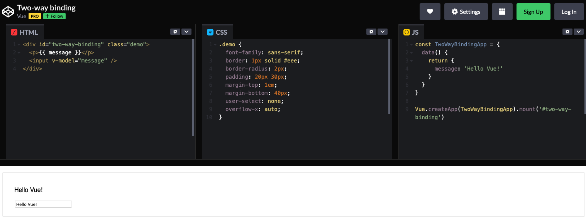

# 八.数据输入（动态渲染组件）

::: tip 前言
动态渲染组件，在页面组件上修改代码，页面会实时呈现出修改后的效果：

:::

用到的核心技术就是`extend`和`$mount`。

## 1.接口设计

- 一个常规的`.vue`文件一般都会包含 3 个部分：
- `<template>`:组件的模板
- `<script>`:组件的选项，不包含`el`
- `<style>`:CSS 样式

回忆一下用`extend`来构造一个组件的实例，它的选项`template`其实就是上面`<template>`的内容，其余选项对应的是`<script>`,样式`<style>`事实上与 Vue.js 无关，我们可以先不管。这样的话，当拿到一个.vue 的文件（整体其实是字符串），只需要把`<template>`、`<script>`、`<style>`使用正则分割，把对应的部分传递给 extend 创建示例就可以。

Display 是一个功能型组件，没有交互和事件，只需要一个 prop：code 将.vue 的内容传递过来，其余工作都是在组件内完成的，这对使用者很友好。当然，你也可以设计成三个 props，分别对应 html、js、css，那分割的工作就要使用者来完成。处于使用者优先的原则，苦活累活当然是在组件内完成了，因此推荐第一个方案。

## 2.实现

在`src/components`目录下创建`display`目录，并新建`display.vue`文件，基本结构如下：

```vue
// display.vue
<template>
  <div ref="display"></div>
</template>
<script>
export default {
  props: {
    code: {
      type: String,
      default: '
    }
  },
  data(){
    return {
      html: '',
      js: '',
      css: ''
    }
  }
}
</script>
```

父级传递`code`后，将其分割，并保存在 data 的 html、js、css 中，后续使用。

我们使用正则，基于`<>`和`</>`的特性进行分割：

```vue
// display.vue,部分代码省略
<script>
export default {
  methods: {
    getSource(source, type) {
      const regex = new RegExp(`<${type}[^>]*>`)
      let openingTag = source.match(regex)
      if (!openingTag) return ""
      else openingTag = openingTag[0]
      return source.slice(
        source.indexOf(openingTag) + openingTag.length,
        source.lastIndexOf(`</${type}>`)
      )
    },
    splitCode() {
      const script = this.getSource(this.code, "script").replace(
        /export default/,
        "return "
      )
      const style = this.getSource(this.code, "style")
      const template =
        '<div id="app">' + this.getSource(this.code, "template") + "</div>"
    },
  },
}
</script>
```

getSource 方法接受两个参数：

- source:vue 文件代码，即 props:code
- type:分割的部分，也就是 template、script、style

分割后，返回的内容不再包含`<template>`等标签，直接是对应的内容，在 splitCode 方法中，把分割好的代码分别赋值给 data 中声明的 html、js、css。有两个细节需要注意：

1.vue 的`<script>`部分一般都是以`export default`开始的，可以看到在 splitCode 方法中将它替换为`return`，这个在后文会做解释，当前只要注意，我们分割完的代码，任然是字符串；

2.在分割的`<tempalte>`外层套了一个`<div id="app">`，这是为了容错，有时使用者传递的`code`可能会忘记在外层包一个节点，没有根节点的组件，是会报错的。

准备好这些基础工作后，就可以用`extend`渲染组件了，在这之前，我们先思考一个问题：上文说到，当前的`this.js`是字符串，而 extend 接收的选项可不是字符串，而是一个对象类型，那就要先把 this.js 转为一个对象。

先看一个例子：

```js
const sum = new Function("a", "b", "return a+b")
console.log(sum(2, 6))
```

可以用 new Function 来构造我们的组件：

```vue
// display.vue 部分代码省略
<template>
  <div ref="display"></div>
</template>
<script>
import Vue from "vue"

export default {
  data() {
    return {
      component: null,
    }
  },
  methods: {
    renderCode() {
      this.splitCode()

      if (this.html !== "" && this.js !== "") {
        const parseStrToFunc = new Function(this.js)()
        parseStrToFunc.template = this.html
        const Component = Vue.extend(parseStrToFunc)
        this.component = new Component().$mount()
        this.$refs.display.appendChild(this.component.$el)
      }
    },
  },
}
</script>
```

extend 构造的实例通过\$mount 渲染后，挂载到了组件唯一一个节点`<div ref = "dispaly">`上。现在 html 和 js 都有了，还剩下 css。创建一个`<style>`标签，然后把 css 写进去，再插入到页面的`<head>`中，这样 css 就被浏览器解析了。为了方便在`this.code`变化或组件销毁时移除动态创建的`<style>`标签，我们给每个`style`标签加一个随机 id 用于标识。

在`src/utils`目录下新建`random_str.js`文件，并写入以下内容：

```js
// 生成随机字符串
export default function(len = 32) {
  const $chars = `abcdefghijklmnopqrstuvwxyzABCDEFGHIJKLMNOPQRSTUVWXYZ1234567890`
  const maxPos = $chars.length
  let str = ""
  for (let i = 0; i < len; i++) {
    str += $chars.charAt(Math.floor(Math.random() * maxPos))
  }
  return str
}
```

不难理解，这个方法是从指定的字符串中随机生成 32 位的字符串。

补全 renderCode 方法：

```vue
// display.vue
<script>
import randomStr from "../../utils/random_str.js"

export default {
  data() {
    return {
      id: randomStr(),
    }
  },
  methods: {
    renderCode() {
      if (this.html !== "" && this.js !== "") {
        // ...
        if (this.css !== "") {
          const style = document.createElement("style")
          style.type = "text/css"
          style.id = this.id
          style.innerHTML = this.css
          document.getElementsByTagName("head")[0].appendChild(style)
        }
      }
    },
  },
}
</script>
```

当 Display 组件销毁时，也要手动销毁 extend 创建的实例以及上面的 css:

```vue
// dispaly.vue
<script>
export default {
  methods: {
    destoryCode() {
      const $target = document.getElementById(this.id)
      if ($target) $target.parentNode.removeChild($target)
      if (this.component) {
        this.$refs.display.removeChild(this.component.$el)
        this.component.$destory()
        this.component = null
      }
    },
  },
  beforeDestory() {
    this.destoryCode()
  },
}
</script>
```

当`this.code`更新时，整个过程要重新来一次，所以要对`code`进行 watch 监听。

```vue
<script>
export default {
  watch: {
    code() {
      this.destoryCode()
      this.renderCode()
    },
  },
}
</script>
```

## 3.使用

新建一条路由，并在`src/views`下新建页面`display.vue`来使用 Display 组件；

```vue
<template>
  <div>
    <h3>动态渲染 .vue 文件的组件-- Display</h3>
    <i-display :code="code"></i-display>
  </div>
</template>
<script>
import iDisplay from "../components/display/display.vue"
import defaultCode from "./default-code.js"

export default {
  components: {
    iDisplay,
  },
  data() {
    return {
      code: defaultCode,
    }
  },
}
</script>
```

<!-- src/views/default-code.js -->

```js
const code = `
<template>
  <div>
    <input v-model="message">
    {{message}}
  </div>
</template>
<script>
  export default {
    data (){
      return {
        message: ''
      }
    }
  }
</script>
`
export default code
```

如果使用 Vue CLI 3 默认的配置，直接运行时，会抛出错误。这是因为它使用了 vue.runtime.js,它不允许编译 template 模板，因为我们在 Vue.extend 构造实例时，用了`template`选项，所以会报错。解决方案有两种,一是手动将 template 改写为 Render 函数，另外一种是对 Vue CLI 3 创建的工程做简单的配置。

```js
module.exports = {
  runtimeCompiler: true,
}
```

他的作用是，是否使用包含运行时编译器的 Vue 构建版本。设置为`true`后就可以在 Vue 组件中使用`template`选项了，但是应用汇额外增加 10kb.
